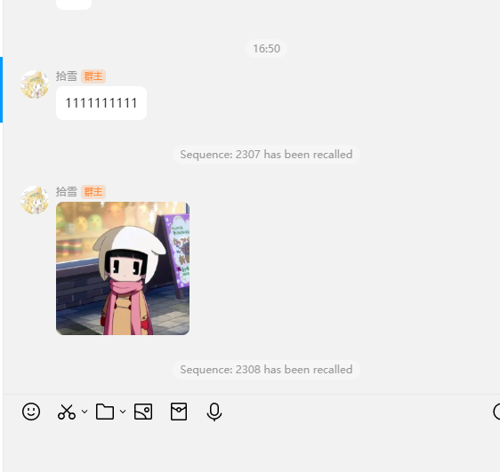

# NTQQFridaCall
Native调用NTQQ 原理演示

## 版本
QQNT 35341

## 实现思路和未来

在ida里面搜索 `MsgService::` 类似字符串即可获取到Wrapper最外层封装MsgService的函数

通常其签名是 sub_xxxx(napi_env env,napi_callback_info info)

这样我们可以通过 napi_create_function 将其包装为napi能调用的函数 导出为napi-js函数

那么调用这个函数秩序传入 napi_env this 该函数js调用情况所需的参数 那么我们便能调用了

napi_env this 可用使用 `MsgService::addMsgListener`初始化监听时捕获napi_env 然后解napi_callback_info获取this

这里是最小化样本 napi_env 貌似不能跨线程保存 其this是否持久我也不清楚 如果有必须可用试试thread_safe或者napi 将这些关键参数持久下去并实现跨线程调用(已实现)

那么我们就能在不注入js的情况下执行我们任意需要的逻辑




## 演示内容
群聊反撤回与小灰条添加

## 如何跑这个演示代码
1. 安装依赖
```
pip install frida
```

2. QQ路径与版本修改 recall_all.py的QQ路径 并安装35341 QQ
3. 搜索`819085771`更换为你想要的群号
4. 启动recall_all.py
